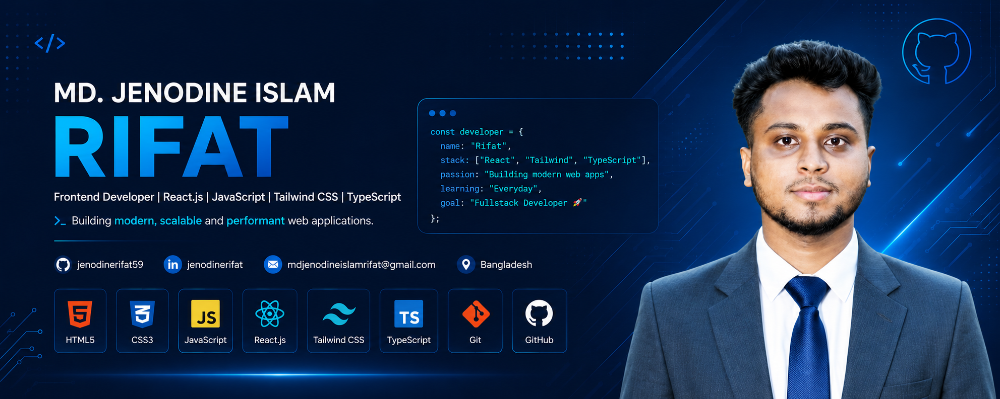

<!-- ========================================= -->
<!--      MD. JENODINE ISLAM RIFAT README       -->
<!-- ========================================= -->

<!-- Typing Animation -->

  

---

  

# 💻 Animated Developer Life

---

# 👨‍💻 About Me

- 🇧🇩 From **Bangladesh**
- 💻 Passionate Frontend Developer
- 🎓 Computer Science & Technology Student
- 🌱 Currently Learning **React, Node.js & MongoDB**
- 🚀 Building Modern Web Applications
- ⚡ Love Clean UI & Creative Design
- 🎯 Dream: Become a Full Stack Developer

 

---

# 📫 Contact Me

---

# 🎯 2026 Goals

- 🌱 Become a Full Stack Developer
- ⚛ Master React Ecosystem
- 🚀 Learn Next.js
- 🟢 Learn Node.js & Express
- 🍃 Master MongoDB
- 🔥 Build Real-World SaaS Projects
- 🌍 Contribute to Open Source
- 💼 Get a Remote Developer Job

---

# ⚒️ Tech Stack

---

# 📊 GitHub Stats

---

# 🐍 Contribution Snake

---

# 📈 Activity Graph

---

# 📑 GitHub Profile Summary

 

---

# 🏆 Badges

---

# 👀 Profile Views

---

# 🚀 Thanks For Visiting

