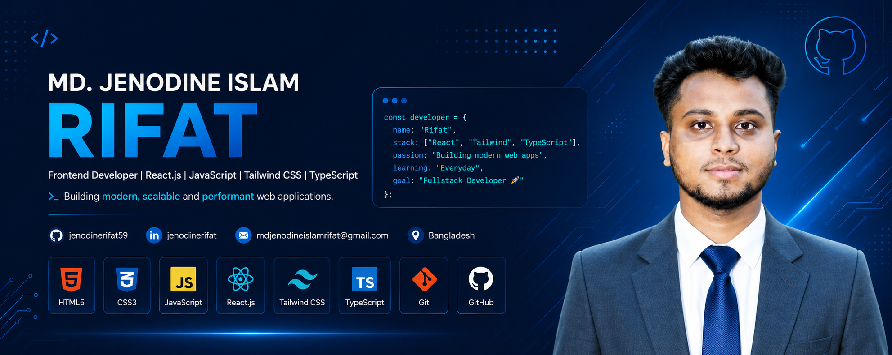

<!-- ========================================================= -->

<!--              MD. JENODINE ISLAM RIFAT                    -->

<!--              GitHub Profile README                        -->

<!-- ========================================================= -->

<!-- ========================= BANNER ========================= -->

<p align="center">
  
<p align="center">
  
</p>
  
</p>

<br>

<!-- ====================== TYPING HEADER ===================== -->


<p align="center">
  <i>Turning ideas into clean, modern and interactive web experiences.</i>
</p>

<br>

<!-- ========================= SOCIALS ======================== -->

<p align="center">

<a href="mailto:mdjenodineislamrifat@gmail.com">

</a>

<a href="https://github.com/jenodinerifat59">

</a>

</p>

<br>

---

<!-- ========================== ABOUT ======================== -->

## 🧑‍💻 About Me

<table>
<tr>
<td width="60%">

### Hey there! 👋

I'm **MD. JENODINE ISLAM RIFAT**, a passionate **Frontend Developer** from Bangladesh 🇧🇩.

I enjoy building **modern, responsive and user-friendly web applications** with a strong focus on clean UI, smooth user experience and maintainable code.

🎓 Currently pursuing my **B.Sc. in Computer Science & Engineering at BUBT**.

💻 My primary focus is **Frontend Development**, especially the React ecosystem and modern Next.js applications.

</td>

<td width="40%" align="center">


</td>
</tr>
</table>

---

<!-- ========================== QUICK INFO =================== -->

## ✨ Quick Info

<p align="center">

|    🎓 Education    |         💻 Focus         |        🌱 Learning       |     📍 Location     |
| :----------------: | :----------------------: | :----------------------: | :-----------------: |
|    **BUBT CSE**    | **Frontend Development** | **Next.js & TypeScript** | **Bangladesh 🇧🇩** |
| **2026 – Present** |    **React Ecosystem**   |      **Better Auth**     |  **Dhaka / Bogura** |

</p>

---

<!-- ========================== TECH STACK =================== -->

## ⚡ Tech Stack

### 🎨 Frontend

<p align="center">
  
</p>

### 🧩 UI & Development Tools

<p align="center">
  
</p>

### 🔐 Authentication & UI Libraries

<p align="center">


</p>

---

<!-- ========================= CURRENT FOCUS ================= -->

## 🌱 Currently Working On

```text
┌──────────────────────────────────────────────────────────────┐
│                                                              │
│   ⚛️  React.js                                               │
│   ▲   Next.js                                                │
│   TS  TypeScript                                             │
│   🎨  Tailwind CSS                                           │
│   🔐  Better Auth                                             │
│   🧩  Modern UI / UX                                         │
│   🚀  Real-world Frontend Projects                           │
│                                                              │
└──────────────────────────────────────────────────────────────┘
```

---

<!-- ============================ GOALS ====================== -->

## 🎯 My Goals

* ⚛️ Become highly skilled in **React.js**
* ▲ Build production-ready **Next.js applications**
* 💙 Improve **TypeScript**
* 🎨 Create beautiful and accessible **UI/UX**
* 🔐 Build secure authentication systems
* 🚀 Build meaningful real-world projects
* 🌍 Contribute to Open Source
* 💼 Start my professional **Frontend Developer** career
* 🧩 Gradually grow toward **Full Stack Development**

---

<!-- ========================= GITHUB STATS ================== -->

## 📊 GitHub Analytics

<p align="center">


</p>

---

<!-- ========================= STREAK ======================== -->

## 🔥 Contribution Streak

<p align="center">


</p>

---

<!-- ========================= ACTIVITY ====================== -->

## 📈 GitHub Activity

<p align="center">


</p>

---

<!-- ===================== PROFILE SUMMARY ================== -->

## 🧠 Profile Overview

<p align="center">


</p>

---

<!-- ================= CONTRIBUTION SNAKE ==================== -->

## 🐍 Contribution Graph

<p align="center">


</p>

---

<!-- ========================= CURRENT STATUS ================ -->

## 🚀 Current Status

<p align="center">


</p>

---

<!-- ========================= PROFILE VIEWS ================= -->

<p align="center">


</p>

<br>

<!-- =========================== FOOTER ====================== -->

<p align="center">


</p>

<p align="center">
  <strong>Thanks for visiting my profile! 💙</strong>
</p>

<p align="center">
  <i>Keep Learning • Keep Building • Keep Growing 🚀</i>
</p>
```

